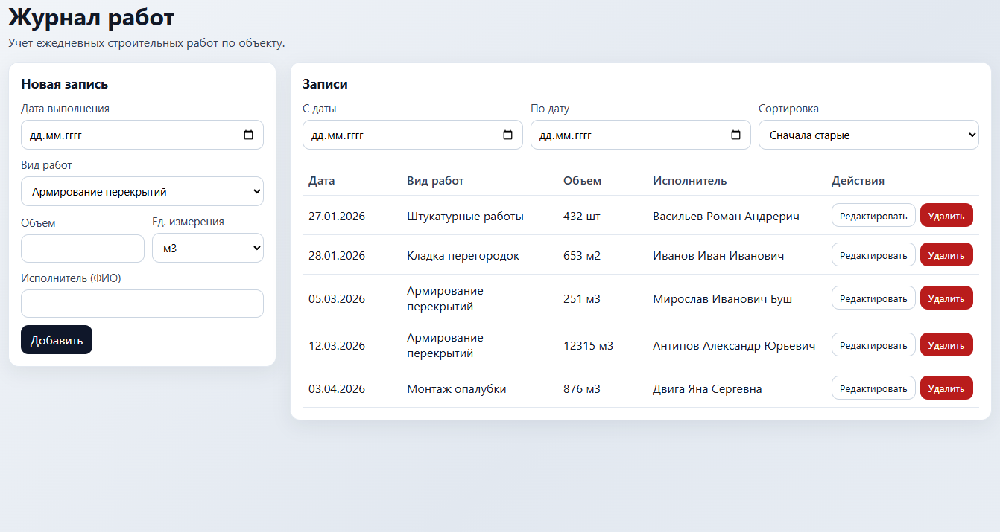

# Construction Works - Журнал работ

Небольшое fullstack-приложение для учета выполненных строительных работ по дням.

## Скриншот интерфейса



## Выбранный стек

- Frontend: React + TypeScript + Vite
- Backend: Node.js + Express + TypeScript
- База данных: PostgreSQL
- ORM: Prisma
- Контейнеризация: Docker + docker-compose

Почему такой выбор:

- React + TypeScript дают быстрый и предсказуемый UI.
- Express позволяет быстро собрать понятный REST API.
- PostgreSQL и Prisma хорошо подходят для CRUD-сценария с фильтрацией по дате.
- docker-compose упрощает запуск проекта одной командой.

## Реализованный функционал

- Список записей журнала с полями:
  - дата выполнения,
  - вид работ (из справочника),
  - объем + единица измерения,
  - ФИО исполнителя.
- Фильтрация по диапазону дат и сортировка (новые/старые).
- Добавление записи с валидацией обязательных полей.
- Редактирование записи.
- Удаление записи.
- Справочник видов работ (предзаполненный seed).

## Структура проекта

- `frontend/` - React-приложение.
- `backend/` - API, Prisma schema, seed.
- `docker-compose.yml` - запуск БД, backend и frontend.

## Запуск через Docker (рекомендуется)

Требования: установлен Docker Desktop.

1. Из корня проекта выполнить:

```bash
docker-compose up --build
```

2. Приложение будет доступно по адресам:

- Frontend: http://localhost:5173
- Backend API: http://localhost:4000/api
- Health-check: http://localhost:4000/api/health

При старте backend автоматически:

- генерирует Prisma client,
- применяет схему к БД (`prisma db push`),
- заполняет справочник видов работ (`prisma seed`).

## Локальный запуск без Docker

Требования: Node.js 22+, PostgreSQL 16+.

1. Установить зависимости:

```bash
npm install
```

2. Убедиться, что PostgreSQL запущен и строка подключения в `backend/.env` актуальна.

3. Подготовить БД:

```bash
npm --workspace backend run prisma:generate
npm --workspace backend run prisma:push
npm --workspace backend run prisma:seed
```

4. Запустить backend:

```bash
npm --workspace backend run dev
```

5. В отдельном терминале запустить frontend:

```bash
npm --workspace frontend run dev
```

## API (кратко)

- `GET /api/health` - статус сервиса.
- `GET /api/work-types` - список видов работ.
- `GET /api/work-logs?dateFrom=YYYY-MM-DD&dateTo=YYYY-MM-DD&sort=desc|asc` - список записей.
- `POST /api/work-logs` - создание записи.
- `PUT /api/work-logs/:id` - редактирование записи.
- `DELETE /api/work-logs/:id` - удаление записи.